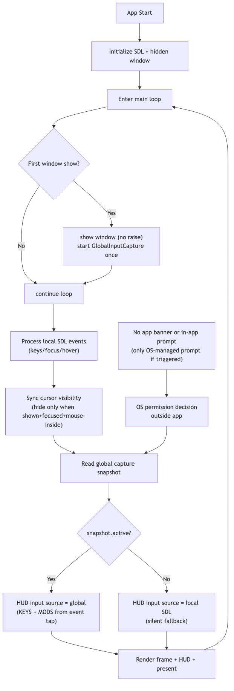

# Global Input Permission Flow

Mermaid source: [`global-input-permission-flow.mmd`](global-input-permission-flow.mmd)
Diagram render script: [`../scripts/docs/render_diagrams.sh`](../scripts/docs/render_diagrams.sh)

## Current Runtime Behavior

- Global capture is started once, after the window is first shown.
- Input mode is selected every frame:
  - global snapshot when active
  - local SDL fallback when not active
- The fallback is silent and non-blocking.
- No app-level permission banner/prompt is shown.
- Any permission UI is OS-managed.
