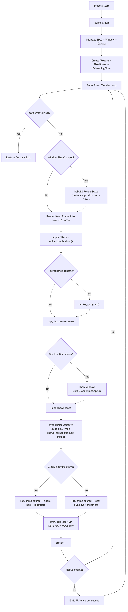

# Control Flow (Default Serenity Runtime)

Mermaid source: [`runtime-input-control-flow.mmd`](runtime-input-control-flow.mmd)
Diagram render script: [`../scripts/docs/render_diagrams.sh`](../scripts/docs/render_diagrams.sh)

The default binary (`src/main.rs`) runs a render loop with a non-blocking input strategy:

1. Startup
- Parse CLI args (`--debug`, `--screenshot`).
- Initialize SDL, create hidden window/canvas, create render state.

2. Loop
- Process SDL events (quit/escape, key tracking, window focus/hover updates).
- Rebuild render state on resize.
- Render neon frame into base buffer, apply filters, upload to texture.
- Optionally write screenshot once.

3. Window + Input
- On first show, the window is shown and global input capture is started.
- Cursor visibility is synchronized from window state:
  - hide only when shown + focused + mouse-inside
  - show otherwise (e.g., overlays/popup focus changes)
- HUD input source selection:
  - global source when capture is active
  - local SDL source as silent fallback

4. HUD + Present
- Draws top-left HUD:
  - `KEYS`: active non-modifier key chord
  - `MODS`: active modifiers
- Presents frame.

5. Debug + Exit
- If debug is enabled, emits FPS every ~1 second.
- On quit, cursor is restored and process exits.

The diagram PNG is generated from `docs/runtime-input-control-flow.mmd`.
